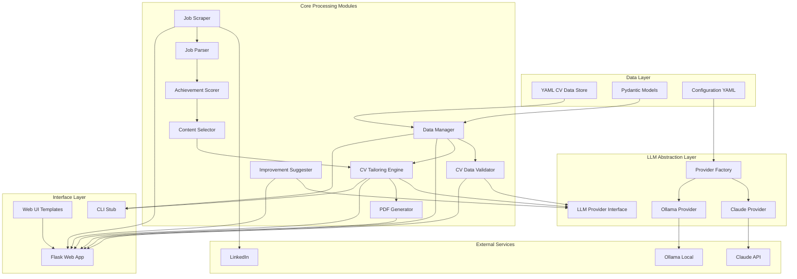
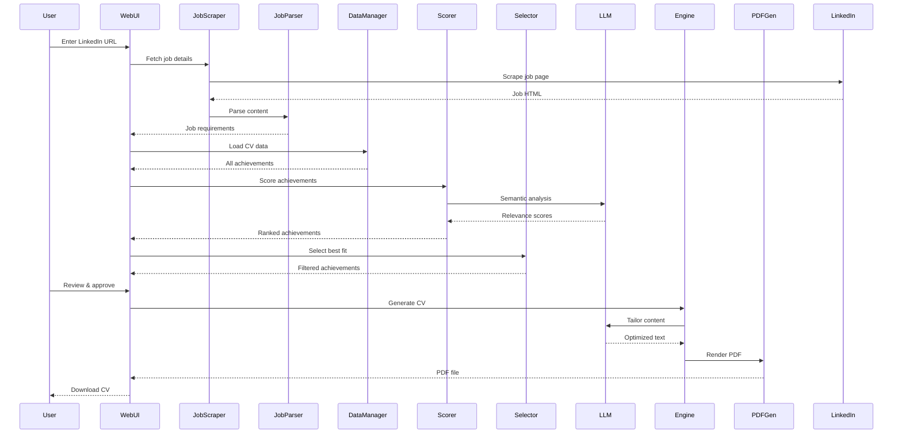
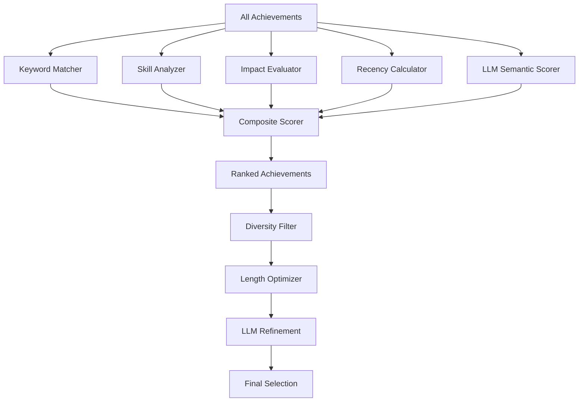

# CV Generator - Complete Project Plan

## Table of Contents
1. [Project Overview](#project-overview)
2. [System Architecture](#system-architecture)
3. [Achievement Scoring System](#achievement-scoring-system)
4. [Technical Specifications](#technical-specifications)
5. [Implementation Plan](#implementation-plan)

---

## 1. Project Overview

### 1.1 Purpose
Build an intelligent CV generator that:
- Stores comprehensive career data in YAML format
- Scrapes job descriptions from LinkedIn
- Uses AI to select and tailor relevant achievements
- Generates ATS-compliant PDF CVs
- Provides data validation and improvement suggestions

### 1.2 Key Features
- **Intelligent Selection**: Not just rewording - selects most relevant achievements from a larger pool
- **Interchangeable LLM**: Support both Claude API and local Ollama
- **Single Job Focus**: User provides one LinkedIn URL at a time
- **Data Validation**: Checks quality and suggests improvements
- **ATS Compliance**: Clean, parseable PDF output
- **Future-Ready**: Extensible for CLI and memory helper features

### 1.3 Technology Stack
- **Language**: Python 3.11+
- **Web Framework**: Flask 3.0+
- **Data Format**: YAML (PyYAML)
- **Validation**: Pydantic 2.0+
- **PDF Generation**: WeasyPrint
- **Web Scraping**: Playwright (for LinkedIn)
- **LLM APIs**: Anthropic SDK (Claude), Ollama Python client
- **Testing**: pytest, pytest-asyncio, pytest-mock
- **Development**: black, pylint, mypy

### 1.4 Key Decisions
- Python with Flask for web framework
- YAML for data storage (human-editable)
- Playwright for LinkedIn scraping with manual fallback
- Abstract LLM interface supporting Claude and Ollama
- Multi-factor achievement scoring system
- WeasyPrint for ATS-compliant PDF generation
- Comprehensive testing with 80%+ coverage goal

---

## 2. System Architecture

### 2.1 High-Level Architecture



### 2.2 CV Generation Workflow



### 2.3 Project Structure

```
cvmaker/
├── config/
│   ├── settings.yaml              # App config, API keys, LLM provider
│   ├── cv_data.yaml               # User's comprehensive CV data
│   └── scoring_weights.yaml       # Customizable scoring parameters
│
├── core/
│   ├── __init__.py
│   ├── models.py                  # Pydantic data models
│   ├── data_manager.py            # YAML CRUD operations
│   ├── validator.py               # CV data validation
│   │
│   ├── llm/
│   │   ├── __init__.py
│   │   ├── provider.py            # Abstract LLM interface
│   │   ├── claude_provider.py     # Claude implementation
│   │   ├── ollama_provider.py     # Ollama implementation
│   │   └── factory.py             # Provider factory
│   │
│   ├── job/
│   │   ├── __init__.py
│   │   ├── scraper.py             # LinkedIn scraper
│   │   └── parser.py              # Job requirement extraction
│   │
│   ├── scoring/
│   │   ├── __init__.py
│   │   ├── scorer.py              # Achievement scoring engine
│   │   ├── keyword_matcher.py     # TF-IDF keyword matching
│   │   ├── skill_analyzer.py      # Skill relevance analysis
│   │   └── impact_evaluator.py    # Impact level assessment
│   │
│   ├── generation/
│   │   ├── __init__.py
│   │   ├── selector.py            # Content selection logic
│   │   ├── engine.py              # CV tailoring engine
│   │   ├── improver.py            # Improvement suggester
│   │   └── pdf_generator.py       # WeasyPrint PDF generation
│   │
│   └── utils/
│       ├── __init__.py
│       ├── config.py              # Configuration management
│       └── logger.py              # Logging setup
│
├── templates/
│   ├── cv/
│   │   ├── modern.html            # Modern CV template
│   │   ├── classic.html           # Classic CV template
│   │   ├── minimal.html           # Minimal CV template
│   │   └── ats_optimized.html     # ATS-focused template
│   │
│   └── web/
│       ├── base.html              # Base layout
│       ├── index.html             # Dashboard
│       ├── data_editor.html       # CV data management
│       ├── job_input.html         # Job description input
│       ├── preview.html           # CV preview
│       └── components/
│           ├── achievement_form.html
│           └── validation_results.html
│
├── static/
│   ├── css/
│   │   ├── cv_styles.css          # PDF CV styles
│   │   ├── web_styles.css         # Web UI styles
│   │   └── ats_compliant.css      # ATS-safe styles
│   │
│   └── js/
│       ├── app.js                 # Main frontend logic
│       ├── data_editor.js         # CV data editing
│       └── preview.js             # Preview functionality
│
├── web/
│   ├── __init__.py
│   ├── app.py                     # Flask application factory
│   ├── routes/
│   │   ├── __init__.py
│   │   ├── main.py                # Main routes
│   │   ├── data.py                # Data management routes
│   │   ├── generation.py          # CV generation routes
│   │   └── api.py                 # REST API routes
│   │
│   └── forms.py                   # WTForms for validation
│
├── cli/
│   ├── __init__.py
│   └── commands.py                # CLI interface (future)
│
├── tests/
│   ├── __init__.py
│   ├── test_data_manager.py
│   ├── test_scorer.py
│   ├── test_llm_providers.py
│   ├── test_cv_engine.py
│   └── fixtures/
│       ├── sample_cv_data.yaml
│       └── sample_job_description.txt
│
├── docs/
│   ├── project_plan.md            # This file
│   ├── yaml_schema.md             # YAML format guide
│   ├── api_reference.md           # API documentation
│   └── user_guide.md              # End-user documentation
│
├── requirements.txt
├── requirements-dev.txt
├── .env.example
├── .gitignore
├── README.md
└── run.py                         # Application entry point
```

### 2.4 Key Design Decisions

#### Modular LLM Abstraction
**Why:** Flexibility to switch between Claude (quality) and Ollama (privacy/cost)
**How:** Abstract interface with provider factory pattern

#### Rich Achievement Data Model
**Why:** Store more than what appears in CV for intelligent selection
**How:** YAML with metadata (skills, impact, metrics) per achievement

#### Multi-Factor Scoring
**Why:** Better relevance than simple keyword matching
**How:** Weighted combination of 5 scoring dimensions

#### Validation & Improvement Loop
**Why:** Help users create better source data
**How:** LLM-powered suggestions for enhancement

#### Flask Over FastAPI
**Why:** Simpler for this use case, better template support
**How:** Blueprint-based modular structure

#### WeasyPrint for PDF
**Why:** HTML/CSS to PDF, ATS-compliant output
**How:** Template-based rendering with clean HTML

---

## 3. Achievement Scoring System

### 3.1 Overview

The achievement scoring system intelligently selects which achievements from comprehensive CV data should be included in a tailored CV for a specific job. Rather than including everything or just rewording content, it ranks each achievement by relevance to the target job.

### 3.2 Multi-Factor Scoring Formula

```
Total Score = (Keyword Match × 0.3) + (Skill Relevance × 0.25) + 
              (Impact Level × 0.20) + (Recency × 0.15) + 
              (LLM Semantic Match × 0.10)
```

### 3.3 Scoring Components

#### A. Keyword Match (30% weight)
- Extract keywords from job description (technologies, tools, methodologies)
- Count direct keyword matches in achievement text
- Apply TF-IDF weighting for important vs common terms
- Bonus for exact phrase matches

**Example:**
```yaml
Job requires: "Python, AWS, microservices, CI/CD"
Achievement: "Built Python microservices on AWS with automated CI/CD pipeline"
Score: High (multiple exact matches)
```

#### B. Skill Relevance (25% weight)
- Map achievement to skill categories (technical, leadership, domain-specific)
- Compare against required skills in job description
- Weight by skill importance (required vs preferred)
- Consider skill level indicators (led, implemented, assisted)

**Example:**
```yaml
Job requires: Senior Backend Developer with team leadership
Achievement: "Led team of 5 developers building scalable backend APIs"
Score: High (leadership + technical match)
```

#### C. Impact Level (20% weight)
- Quantifiable metrics (%, $, time saved, users impacted)
- Scale indicators (team size, project scope, user base)
- Business impact keywords (revenue, efficiency, cost reduction)
- Innovation indicators (first, new, pioneered)

**Scoring rubric:**
- High impact: Quantified business results (e.g., "Increased revenue by 40%")
- Medium impact: Measurable technical improvements (e.g., "Reduced latency by 50ms")
- Low impact: Task completion without metrics (e.g., "Implemented feature X")

#### D. Recency (15% weight)
- More recent achievements score higher
- Decay function: `score = 1 / (1 + years_ago * 0.2)`
- Can be overridden for highly relevant older achievements

**Example:**
```
2024 achievement: score = 1.0
2022 achievement: score = 0.71
2020 achievement: score = 0.56
2018 achievement: score = 0.45
```

#### E. LLM Semantic Match (10% weight)
- Use LLM to assess semantic similarity between achievement and job requirements
- Captures nuanced matches that keyword search might miss
- Understands context and transferable skills

**Example:**
```yaml
Job: "Experience with distributed systems"
Achievement: "Designed event-driven architecture handling 1M+ daily events"
LLM recognizes: Event-driven architecture is a distributed systems pattern
```

### 3.4 Selection Algorithm



**Phase 1: Initial Scoring**
```python
for achievement in all_achievements:
    achievement.score = calculate_composite_score(achievement, job_description)
```

**Phase 2: Diversity Filtering**
- Ensure variety across different skill areas
- Avoid redundant achievements (similar content)
- Balance technical vs soft skills based on job requirements

**Phase 3: Length Optimization**
- Target CV length: 1-2 pages
- Select top N achievements per role based on scores
- Prioritize recent roles but include standout older achievements

**Phase 4: LLM Refinement**
- Present selected achievements to LLM
- Ask: "Are these the most relevant? Any critical gaps?"
- Allow LLM to suggest swaps or additions

### 3.5 Example Workflow

**Input Data (YAML):**
```yaml
experience:
  - company: "TechCorp"
    position: "Senior Software Engineer"
    start_date: "2022-01"
    end_date: "2024-12"
    achievements:
      - text: "Built Python microservices handling 10M requests/day"
        skills: [Python, Microservices, AWS, Docker]
        impact: "high"
        metrics: {requests: "10M/day", uptime: "99.9%"}
        
      - text: "Led migration from monolith to microservices architecture"
        skills: [Architecture, Leadership, Microservices]
        impact: "high"
        metrics: {team_size: 5, duration: "6 months"}
        
      - text: "Implemented automated testing reducing bugs by 60%"
        skills: [Testing, CI/CD, Quality]
        impact: "medium"
        metrics: {bug_reduction: "60%"}
        
      - text: "Mentored 3 junior developers"
        skills: [Mentoring, Leadership]
        impact: "medium"
        metrics: {mentees: 3}
        
      - text: "Fixed legacy authentication system"
        skills: [Security, Debugging]
        impact: "low"
```

**Job Description:**
```
Senior Backend Engineer
Required: Python, AWS, microservices, scalability
Preferred: Team leadership, system design
```

**Scoring Results:**
```
Achievement 1: 0.92 (High keyword match + high impact + recent)
Achievement 2: 0.88 (Leadership + architecture + high impact)
Achievement 3: 0.65 (Relevant but less critical)
Achievement 4: 0.58 (Leadership but not technical focus)
Achievement 5: 0.35 (Low relevance, low impact)
```

**Selection Decision:**
- Include: Achievements 1, 2, 3 (scores 0.92, 0.88, 0.65)
- Exclude: Achievements 4, 5 (less relevant for this role)

### 3.6 Configuration

Users can adjust scoring weights in `settings.yaml`:

```yaml
scoring:
  weights:
    keyword_match: 0.30
    skill_relevance: 0.25
    impact_level: 0.20
    recency: 0.15
    semantic_match: 0.10
  
  thresholds:
    minimum_score: 0.50  # Don't include achievements below this
    max_per_role: 5      # Maximum achievements per job
    
  preferences:
    favor_recent: true   # Boost recent achievements
    require_metrics: false  # Require quantified impact
```

---

## 4. Technical Specifications

### 4.1 YAML Schema for CV Data

```yaml
personal:
  name: string (required)
  email: string (required, email format)
  phone: string (optional)
  location: string (optional)
  linkedin: string (optional, URL)
  github: string (optional, URL)
  website: string (optional, URL)

summary: string (optional, 2-3 sentences)

experience:
  - company: string (required)
    position: string (required)
    location: string (optional)
    start_date: string (required, YYYY-MM format)
    end_date: string (optional, YYYY-MM or "present")
    description: string (optional, brief role overview)
    achievements:
      - text: string (required, the achievement description)
        skills: list[string] (required, related skills/technologies)
        impact: string (required, one of: high, medium, low)
        metrics: dict (optional, quantifiable data)
          # Examples:
          # revenue: "40%"
          # users: "1M+"
          # performance: "50ms reduction"
        keywords: list[string] (optional, additional keywords)
        
skills:
  technical:
    - name: string
      level: string (optional, one of: expert, advanced, intermediate, beginner)
      years: int (optional)
  soft:
    - string (e.g., "Leadership", "Communication")
  languages:
    - language: string
      proficiency: string (e.g., "Native", "Fluent", "Professional")

education:
  - institution: string (required)
    degree: string (required)
    field: string (optional)
    location: string (optional)
    graduation_date: string (required, YYYY-MM or YYYY)
    gpa: string (optional)
    honors: list[string] (optional)
    relevant_coursework: list[string] (optional)

certifications:
  - name: string (required)
    issuer: string (required)
    date: string (required, YYYY-MM)
    expiry: string (optional, YYYY-MM)
    credential_id: string (optional)

projects:
  - name: string (required)
    description: string (required)
    technologies: list[string] (required)
    url: string (optional)
    achievements: list[string] (optional)
```

### 4.2 LLM Provider Interface

```python
from abc import ABC, abstractmethod

class LLMProvider(ABC):
    @abstractmethod
    def generate(self, prompt: str, system: Optional[str] = None, 
                 max_tokens: int = 4096) -> str:
        """Generate text from prompt"""
        
    @abstractmethod
    def analyze_job(self, job_description: str) -> JobDescription:
        """Extract structured data from job description"""
        
    @abstractmethod
    def score_achievement_semantic(self, achievement: str, 
                                   job_context: Dict) -> float:
        """Semantic similarity score (0-1)"""
        
    @abstractmethod
    def suggest_improvements(self, cv_data: CVData) -> List[str]:
        """Generate improvement suggestions"""
        
    @abstractmethod
    def tailor_achievement(self, achievement: Achievement, 
                          job_context: Dict) -> str:
        """Rewrite achievement for specific job"""
```

### 4.3 Configuration Schema

```yaml
# config/settings.yaml

llm:
  provider: "claude"  # or "ollama"
  claude:
    api_key: "${CLAUDE_API_KEY}"  # From environment
    model: "claude-3-5-sonnet-20241022"
    max_tokens: 4096
    temperature: 0.7
  ollama:
    base_url: "http://localhost:11434"
    model: "llama3.1"
    timeout: 60

app:
  debug: false
  host: "127.0.0.1"
  port: 5000
  secret_key: "${FLASK_SECRET_KEY}"

scoring:
  weights:
    keyword_match: 0.30
    skill_relevance: 0.25
    impact_level: 0.20
    recency: 0.15
    semantic_match: 0.10
  thresholds:
    minimum_score: 0.50
    max_achievements_per_role: 5
  preferences:
    favor_recent: true
    require_metrics: false

pdf:
  default_template: "modern"
  page_size: "A4"
  font_family: "Arial"
  font_size: 11

scraping:
  linkedin:
    timeout: 30
    headless: true
    user_agent: "Mozilla/5.0 (Macintosh; Intel Mac OS X 10_15_7)"
    retry_attempts: 3
    retry_delay: 2

logging:
  level: "INFO"
  format: "%(asctime)s - %(name)s - %(levelname)s - %(message)s"
  file: "logs/cvmaker.log"
```

### 4.4 LinkedIn Scraping Strategy

**Approach: Playwright with Manual Fallback**

**Rationale:**
- LinkedIn requires JavaScript rendering
- Playwright handles dynamic content well
- Can handle authentication if needed
- Better than Selenium for modern web apps

**Implementation:**
```python
class LinkedInScraper:
    async def scrape_job(self, url: str) -> Optional[Dict]:
        """
        Scrape job details from LinkedIn URL
        Returns None if scraping fails (triggers manual fallback)
        """
        async with async_playwright() as p:
            browser = await p.chromium.launch(headless=self.headless)
            page = await browser.new_page()
            
            try:
                await page.goto(url, timeout=self.timeout * 1000)
                await page.wait_for_selector('.job-details', timeout=5000)
                
                # Extract job details
                title = await page.text_content('.job-title')
                company = await page.text_content('.company-name')
                description = await page.text_content('.job-description')
                
                return {
                    'title': title,
                    'company': company,
                    'description': description,
                    'url': url
                }
            except Exception as e:
                logger.error(f"Scraping failed: {e}")
                return None
            finally:
                await browser.close()
```

**Fallback Strategy:**
If scraping fails:
1. Show error message to user
2. Provide text area for manual paste
3. Parse pasted text using LLM
4. Continue with CV generation

### 4.5 Testing Strategy

**Test Pyramid:**
```
        /\
       /  \
      / E2E \     (5% - Full workflow tests)
     /______\
    /        \
   / Integration \   (25% - Module interaction tests)
  /______________\
 /                \
/   Unit Tests     \  (70% - Individual function tests)
/____________________\
```

**Coverage Goals:**
- Overall: 80%+
- Core modules: 90%+
- Scoring system: 95%+
- LLM providers: 85%+
- Web routes: 75%+

**Test Execution:**
```bash
# Run all tests
pytest

# Run with coverage
pytest --cov=core --cov=web --cov-report=html

# Run only unit tests (fast)
pytest -m "not integration and not e2e"

# Run integration tests
pytest -m integration
```

---

## 5. Implementation Plan

### Phase 1: Foundation (Week 1-2)

#### Task 1: Set up project structure with modular architecture

**Objective**: Create complete directory structure separating core logic from UI.

**Actions**:
- Create all directories per architecture section
- Add `__init__.py` files for Python packages
- Set up `.gitignore` for Python
- Initialize git repository

**Deliverables**: Complete directory structure, git initialized

**Acceptance**: All directories exist, Python can import modules

---

#### Task 2: Create Python virtual environment and requirements.txt

**Objective**: Set up isolated environment with dependencies.

**Key Dependencies**:
- pyyaml, pydantic, anthropic, ollama (core)
- flask, jinja2 (web)
- weasyprint (PDF)
- playwright (scraping)
- pytest, black, pylint (dev)

**Deliverables**: venv created, requirements.txt, requirements-dev.txt

**Acceptance**: `pip install -r requirements.txt` succeeds

---

#### Task 3: Design comprehensive YAML schema for CV data

**Objective**: Define complete YAML structure with rich metadata.

**Key Sections**:
- personal: name, email, contact info
- experience: company, position, dates, achievements[]
- achievements: text, skills[], impact, metrics{}
- skills: technical[], soft[], languages[]
- education, certifications, projects

**Deliverables**: Schema documentation, example cv_data.yaml

**Acceptance**: Schema supports scoring system, example validates

---

#### Task 4: Implement core data manager module

**Objective**: Build YAML file operations with validation and backup.

**Key Methods**:
```python
class DataManager:
    load() -> CVData
    save(data: CVData) -> None
    backup() -> str
    add_achievement(company, achievement)
    update_achievement(company, index, achievement)
    delete_achievement(company, index)
```

**Features**: Atomic writes, automatic backups, validation

**Deliverables**: DataManager class, unit tests

**Acceptance**: All CRUD operations work, 90%+ test coverage

---

#### Task 5: Create Pydantic models for data validation

**Objective**: Define type-safe models with validation.

**Key Models**:
- PersonalInfo, Achievement, Experience
- Skills, Education, CVData
- JobDescription, ScoredAchievement

**Features**: Email/URL validation, custom validators, type hints

**Deliverables**: Complete models in core/models.py

**Acceptance**: Models validate correctly, mypy passes

---

### Phase 2: LLM Integration (Week 2-3)

#### Task 6: Design abstract LLM provider interface

**Objective**: Create abstract base class for LLM providers.

**Key Methods**:
```python
class LLMProvider(ABC):
    generate(prompt, system, max_tokens, temperature) -> str
    analyze_job(job_description) -> JobDescription
    score_achievement_semantic(achievement, job_context) -> float
    suggest_improvements(cv_data) -> List[str]
    tailor_achievement(achievement, job_context) -> str
```

**Deliverables**: Abstract interface, custom exceptions

**Acceptance**: Interface is well-defined, documented

---

#### Task 7: Implement Claude API provider

**Objective**: Concrete implementation using Claude API.

**Features**:
- Use Anthropic SDK
- Retry logic with exponential backoff
- Prompt templates for each operation
- Error handling (API, timeout, rate limit)

**Deliverables**: ClaudeProvider class, unit tests with mocks

**Acceptance**: All methods work, 85%+ coverage

---

#### Task 8: Implement Ollama local LLM provider

**Objective**: Implementation using local Ollama.

**Features**:
- REST API or Python client
- Availability checking
- Timeout handling
- Same interface as Claude

**Deliverables**: OllamaProvider class, setup documentation

**Acceptance**: Works with local Ollama, same interface

---

#### Task 9: Add LLM provider factory and configuration

**Objective**: Factory pattern for easy provider switching.

**Features**:
```python
class LLMFactory:
    create(config) -> LLMProvider
```
- Read from settings.yaml
- Environment variable substitution
- Provider validation

**Deliverables**: Factory class, configuration examples

**Acceptance**: Can create both providers from config

---

### Phase 3: Job Processing (Week 3-4)

#### Task 10: Implement single LinkedIn job scraper

**Objective**: Scrape one job posting at a time.

**Features**:
- Playwright for JavaScript rendering
- Timeout and retry logic
- Return None on failure (triggers manual fallback)
- Rate limiting

**Key Method**:
```python
async def scrape_job(url: str) -> Optional[Dict]
```

**Deliverables**: LinkedInScraper class, async/sync interfaces

**Acceptance**: Can scrape basic details, handles failures gracefully

---

#### Task 11: Create job description parser

**Objective**: Extract structured requirements from job text.

**Features**:
- LLM-based extraction
- Regex keyword extraction
- Parse requirements, skills, seniority
- Combine multiple extraction methods

**Deliverables**: JobParser class, unit tests

**Acceptance**: Extracts requirements accurately, 85%+ coverage

---

### Phase 4: Scoring System (Week 4-5)

#### Task 12: Build intelligent CV content selector

**Objective**: Select best achievements based on scores.

**Features**:
- Filter by minimum score
- Respect max per role
- Ensure diversity across skills
- Optimize for target length

**Key Method**:
```python
def select(scored_achievements, target_length) -> List[ScoredAchievement]
```

**Deliverables**: ContentSelector class, unit tests

**Acceptance**: Selects relevant achievements, ensures diversity

---

#### Task 13: Implement achievement scoring system

**Objective**: Multi-factor scoring engine.

**Scoring Components** (with weights):
1. Keyword Match (30%): TF-IDF weighted
2. Skill Relevance (25%): Map to job requirements
3. Impact Level (20%): high/medium/low + metrics
4. Recency (15%): Time-decay function
5. Semantic Match (10%): LLM similarity

**Key Method**:
```python
def score_all(achievements, job, dates) -> List[ScoredAchievement]
```

**Deliverables**: AchievementScorer class, all components, tests

**Acceptance**: All components work, scores in 0-1 range, 95%+ coverage

---

#### Task 14: Create CV tailoring engine

**Objective**: Generate tailored CV content.

**Features**:
- Rewrite achievements using LLM
- Tailor professional summary
- Prioritize relevant skills
- Select relevant projects
- Maintain truthfulness

**Key Method**:
```python
def generate(cv_data, selected_achievements, job) -> Dict
```

**Deliverables**: CVEngine class, prompt templates

**Acceptance**: Generates tailored content, maintains accuracy

---

### Phase 5: Validation & Improvement (Week 5-6)

#### Task 15: Add CV data validator

**Objective**: Check completeness and quality of CV data.

**Validation Checks**:
- Required fields present
- Date formats valid
- Achievement quality (metrics, clarity)
- Email/URL formats
- Skill categorization

**Key Method**:
```python
def validate(cv_data) -> ValidationResult
```

**Deliverables**: CVValidator class, validation rules

**Acceptance**: Identifies issues accurately, clear error messages

---

#### Task 16: Implement CV improvement suggester

**Objective**: LLM-powered suggestions for enhancement.

**Suggestion Types**:
- Add quantifiable metrics
- Strengthen action verbs
- Clarify technical details
- Highlight impact
- Fix grammar/spelling

**Key Method**:
```python
def suggest_improvements(cv_data) -> List[str]
```

**Deliverables**: ImprovementSuggester class, prompt templates

**Acceptance**: Generates actionable suggestions

---

### Phase 6: PDF Generation (Week 6-7)

#### Task 17: Design ATS-compliant HTML/CSS templates

**Objective**: Create professional, parseable CV templates.

**Templates**:
- modern.html: Clean, contemporary design
- classic.html: Traditional format
- minimal.html: Simple, text-focused

**ATS Requirements**:
- Simple HTML structure
- Standard fonts (Arial, Calibri)
- Clear section headers
- No images or complex layouts
- Semantic HTML tags

**Deliverables**: 3 HTML templates, CSS files

**Acceptance**: Templates are ATS-compliant, visually professional

---

#### Task 18: Implement PDF generation module

**Objective**: Render HTML to PDF using WeasyPrint.

**Features**:
- Template selection
- Data injection
- Page size configuration
- Font embedding
- Quality optimization

**Key Method**:
```python
def generate(cv_data, template) -> str  # Returns PDF path
```

**Deliverables**: PDFGenerator class, template rendering

**Acceptance**: Generates clean PDFs, ATS-compliant

---

### Phase 7: Web Interface (Week 7-8)

#### Task 19: Create Flask web application

**Objective**: Build modular Flask app structure.

**Structure**:
- Blueprint-based routes
- main.py: Dashboard
- data.py: CV data management
- generation.py: CV generation
- api.py: REST endpoints

**Deliverables**: Flask app with blueprints, base templates

**Acceptance**: App runs, routes accessible

---

#### Task 20: Build web UI for CV data management

**Objective**: Interface for managing CV data.

**Features**:
- View all CV sections
- Add/edit/delete achievements
- Form validation
- Success/error messages
- Responsive design

**Routes**:
- /data: View data
- /data/edit/<section>: Edit section
- /data/achievement/add: Add achievement

**Deliverables**: Data management templates, forms

**Acceptance**: Can perform all CRUD operations via UI

---

#### Task 21: Add job description input interface

**Objective**: Interface for job input.

**Features**:
- LinkedIn URL input
- Manual paste textarea
- Scraping progress indicator
- Fallback to manual on scrape failure
- Job details preview

**Routes**:
- /generate: Input interface
- /generate/job: Process job (POST)

**Deliverables**: Job input templates, processing logic

**Acceptance**: Can input job via URL or paste

---

#### Task 22: Implement interactive CV generation workflow

**Objective**: Complete generation flow with preview.

**Workflow**:
1. Input job description
2. Show job summary
3. Score and select achievements
4. Preview CV with selections
5. Allow adjustments
6. Generate PDF
7. Download

**Routes**:
- /generate/preview: Show preview
- /generate/download: Generate PDF

**Deliverables**: Preview templates, generation endpoints

**Acceptance**: Complete workflow works end-to-end

---

### Phase 8: Future Features (Week 8-9)

#### Task 23: Create achievement memory helper (future)

**Objective**: Interactive questioning to recall accomplishments.

**Features**:
- Ask targeted questions about role
- Help surface forgotten achievements
- Guide metric quantification
- Save responses to CV data

**Status**: Planned for future release

**Deliverables**: Design document, prototype

---

#### Task 24: Create CLI interface stub

**Objective**: Command-line interface foundation.

**Commands**:
- cvmaker generate <job_url>
- cvmaker validate
- cvmaker add-achievement

**Deliverables**: CLI stub in cli/commands.py

**Acceptance**: Basic CLI structure in place

---

### Phase 9: Polish (Week 9-10)

#### Task 25: Add configuration file management

**Objective**: Centralized configuration.

**Configuration**:
- settings.yaml: App settings, API keys
- scoring_weights.yaml: Scoring parameters
- Environment variable support
- Validation

**Deliverables**: Config management in core/utils/config.py

**Acceptance**: Configuration loads correctly, validates

---

#### Task 26: Implement comprehensive error handling

**Objective**: Robust error handling throughout.

**Features**:
- Custom exception hierarchy
- Graceful degradation
- User-friendly error messages
- Logging at appropriate levels
- Retry logic where appropriate

**Deliverables**: Error handling in all modules, logging setup

**Acceptance**: App handles errors gracefully, logs useful info

---

#### Task 27: Write documentation

**Objective**: Complete user and developer documentation.

**Documents**:
- README.md: Project overview, setup
- docs/user_guide.md: End-user instructions
- docs/api_reference.md: API documentation
- docs/yaml_schema.md: CV data format
- docs/development.md: Developer guide

**Deliverables**: Complete documentation set

**Acceptance**: Documentation is clear, comprehensive

---

#### Task 28: Add unit tests for core modules

**Objective**: Comprehensive test coverage.

**Test Types**:
- Unit tests (70%): Individual functions
- Integration tests (25%): Module interactions
- E2E tests (5%): Full workflows

**Coverage Goals**:
- Overall: 80%+
- Core modules: 90%+
- Scoring system: 95%+

**Deliverables**: Complete test suite, CI configuration

**Acceptance**: Tests pass, coverage goals met

---

## Summary

**Total Tasks**: 28
**Estimated Duration**: 10 weeks

**Key Milestones**:
- Week 2: Foundation complete
- Week 3: LLM integration working
- Week 4: Job processing functional
- Week 5: Scoring system operational
- Week 7: PDF generation working
- Week 8: Web UI complete
- Week 10: Production-ready

**Success Criteria**:
- All 28 tasks completed
- 80%+ test coverage achieved
- Documentation complete
- Application is functional and user-friendly
- Code is maintainable and well-structured

**Discussion Points**:
1. LinkedIn scraping approach - authenticated vs unauthenticated
2. LLM API key management - user-provided vs application-provided
3. Template customization level for MVP
4. Database option for future scalability